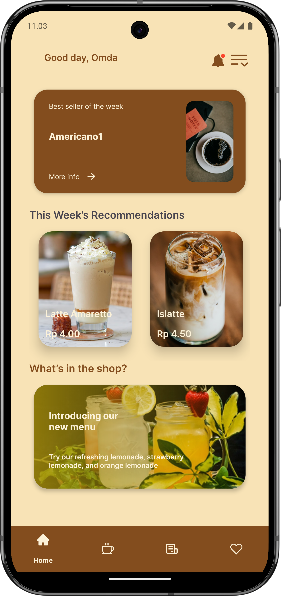

# BrewBuddy ☕️

Welcome to **BrewBuddy**, a modern Android app for coffee lovers to browse, order, and manage their favorite drinks! This README walks you through features (with screenshots), explains the codebase structure, and details the app's architecture.

---

## Features

### 1. **Onboarding & Login**
- Greeted with a splash screen and prompted to enter your name.
- Username is saved for a personalized experience.
- 
- 

---

### 2. **Home Screen**
- **Best Seller** and **Weekly Recommendations** are highlighted.
- Recommendations are cached locally and shown even offline.
- 

---

### 3. **Menu Browsing**
- Browse hot/iced coffees with toggles.
- Search instantly by name, description, or ingredients.
- Add to order with the "+" button, or tap for more details.
- 

---

### 4. **Coffee Detail Bottom Sheet**
- Shows an image, description, price, and quantity selector.
- "Buy Now" opens the payment sheet.
- "Favorite" (heart) toggles the item as favorite and shows a dialog.
- 

---

### 5. **Favorites**
- All your favorited coffees in one place.
- Tap to see details or buy.
- 

---

### 6. **Order Payment (Bottom Sheet)**
- Edit your delivery address inline with a beautiful rounded input.
- See a detailed price breakdown: item, fees, total.
- Place your order with a single tap!
- 

---

### 7. **Orders History**
- View all your recent and past orders.
- Filter between recent and previous orders.
- 

---

### 8. **Caching & Offline Support**
- Menu, recommendations, best seller, and recent orders all work offline.

---

## Project Structure

### Root Structure

```plaintext
BrewBuddy/
├── app/            # Presentation Layer (UI, Fragments, Activities, ViewModels)
├── domain/         # Domain Layer (business logic, usecases, core models & repo interfaces)
├── data/           # Data Layer (Room DB, Repos, DAOs, API, DTOs)
└── README.md
```

### Layer Breakdown

#### app/ (Presentation Layer)
```plaintext
app/
├── src/main/java/emad/space/brewbuddy/
│   ├── ui/
│   │   ├── home/                 # Home screen, best/recommendations logic
│   │   ├── menu/                 # Menu screen logic
│   │   ├── detail/               # Coffee detail sheet & fragment
│   │   ├── orders/               # Orders list/history
│   │   ├── favourites/           # Favorites screen
│   │   ├── payment/              # Payment bottom sheet/fragment
│   │   ├── onboarding/           # Splash/login/onboarding
│   │   └── shared/               # Shared adapters, base classes
│   ├── MainActivity.kt           # Main launcher activity
│   └── BrewBuddyApp.kt           # App entrypoint
├── res/
│   ├── layout/                   # XML layouts (fragments, sheets, dialogs)
│   ├── drawable/                 # Icons, shapes, backgrounds
│   ├── pic/                      # Project screenshots for README
│   ├── values/                   # Strings, colors, themes, styles
│   └── navigation/               # Navigation graphs
└── AndroidManifest.xml
```

#### domain/ (Domain Layer)
```plaintext
domain/
├── src/main/java/emad/space/domain/
│   ├── models/         # Core data models (CoffeeItem, Order, etc.)
│   ├── usecases/       # Use cases (business logic)
│   └── repo/           # Repository interfaces (abstractions for data sources)
└── build.gradle
```

#### data/ (Data Layer)
```plaintext
data/
├── src/main/java/emad/space/data/
│   ├── local/                  # Room database, DAOs, Entities, converters
│   ├── remote/                 # Retrofit API definitions & DTOs
│   ├── repo/                   # Repository implementations
│   ├── pricing/                # Pricing repository (local logic)
│   ├── prefs/                  # User preferences (DataStore/SharedPrefs)
│   ├── di/                     # Dependency injection (Hilt modules)
│   └── DataModule.kt           # Provides dependencies for DI
└── build.gradle
```

---

## How to Run

1. Clone the repo.
2. Open in Android Studio (Arctic Fox or newer).
3. Run on emulator or device (API 23+).
4. No API keys needed — works offline after first sync!

---

## Technologies

- **Kotlin**, **Coroutines**, **Flow**
- **Room** (local DB), **Retrofit**
- **Material Components**
- **Hilt** (DI)
- **MVVM** + Clean Architecture

---

## Screenshots

Below are major screens (see `/pic/` for the images):

| Splash         | Login          | Home           |
|----------------|---------------|----------------|
|  |  |  |

| Menu           | Detail         | Favorites      |
|----------------|---------------|----------------|
|  |  |  |

| Payment        | Orders         |
|----------------|---------------|
|  |  |

---

## Feature Overview

- **Onboarding:** Personalize with your name.
- **Home:** Shows best seller and weekly picks (cached).
- **Menu:** Browse/search all drinks; add to order.
- **Detail:** See full info, set quantity, favorite.
- **Favorites:** Quick access, order from favorites.
- **Payment:** Place an order, edit address inline, see full price breakdown.
- **Orders:** Track your order history, recent/past filters.
- **Offline:** All core features work offline after first sync.

---

## Contributing

Pull requests are welcome! Please open an issue to discuss your idea before contributing.

---

Enjoy your coffee with **BrewBuddy**! ☕️
